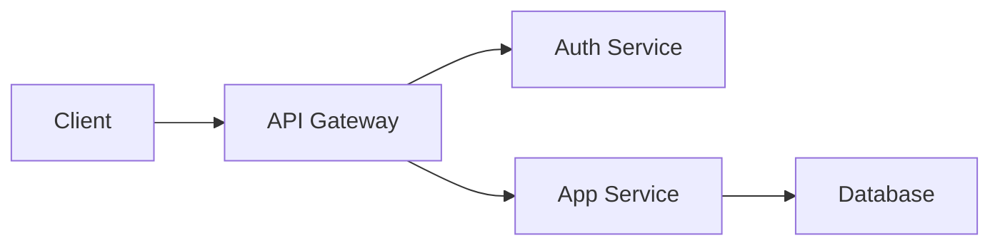

# Architecture

Describe your app's architecture here.

## Tech Stack

| Layer | Technology |
|-------|-----------|
| Frontend | React |
| Backend | Node.js |
| Database | PostgreSQL |
| Hosting | AWS |

## System Diagram

Add your architecture diagram here. You can use images or Mermaid diagrams:

